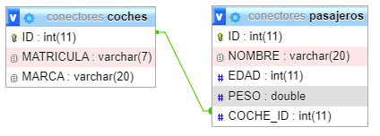
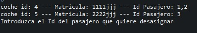

# AD-2 Conectores

## Objetivos:

Se desea hacer un CRUD completo de la entidad Coche , trabajara en una base de datos MySQL y se deberá realizar la opción de modificar coche por ID. Se implementara el patrón DAO. El menú mostrado será de la siguiente forma:

- Añadir nuevo coche (El ID lo incrementará automáticamente la base de datos)
- Borrar coche por ID
- Consulta coche por ID
- Modificar coche por ID
- Listado de coches
- Gestión de pasajeros
- Terminar el programa

La opción de Gestión de pasajeros trabajara sobre una tabla Pasajeros asociada a Coches, donde los  coches tendrán asociados N pasajeros.

- Añadir nuevo pasajero
- Borrar pasajero por id
- Consulta pasajero por id
- Listar todos los pasajeros
- Añadir pasajero a coche. Sería una buena opción mostrar todos los coches disponibles.
- Eliminar pasajero de un coche. Sería una buena opción mostrar todos los coches y sus pasajeros asociados.
- Listar todos los pasajeros de un coche.

## Diseño de bbdd



## Explicación puntos importantes

La idea es que nuestra base de datos se llame **Conectores,** por lo cual creamos una función para comprobar si existe una base de datos con ese nombre.

```java
/**
	 * Intentara conectarse a la bbdd localhost:3306/CONECTORES
	 * @return True - Se ha podido conectar a CONECTORES <p>False - En caso contrario</p>
	 */
	public boolean abrirConexion(){
		String url = "jdbc:mysql://localhost:3306/CONECTORES";
		String usuario = "root";
		String password = "";
		try {
			conexion = DriverManager.getConnection(url,usuario,password);
		} catch (SQLException e) {			
			return false;
		}
		return true;
	}
```

En caso de que nos devuelva `false` ejecutaremos dos funciones, una que creara la base de datos y la segunda que creara las tablas con la estructura que queremos. 

```java
/**
	 * Creara una BBDD llamada CONECTORES en localhost:3306
	 * @return  @return True - Se ha podido crear CONECTORES <p>False - En caso contrario</p>
	 */
	public boolean crearBaseDatos(){
		String url = "jdbc:mysql://localhost:3306/";
		String usuario = "root";
		String password = "";
		try {
			String sql = "CREATE DATABASE CONECTORES";
			conexion = DriverManager.getConnection(url,usuario,password);
			Statement st = conexion.createStatement();
			st.executeUpdate(sql);
			cerrarConexion();	
			
		} catch (SQLException e) {
			// TODO Auto-generated catch block
			e.printStackTrace();
			return false;
		}
		return true;
	}
/**
	 * Buscara en la bbdd las tablas COCHES y PASAJEROS.
	 * Si no las encuentra, las creara.
	 */
	public void checkTable() {
		
		try {
			abrirConexion();
			String[] tables = {"COCHES","PASAJEROS"};
			DatabaseMetaData metaData = conexion.getMetaData();
			for (int i=0; i<tables.length; i++) {
				ResultSet rs = metaData.getTables(null,null,tables[i],null);
				if(!rs.next()) {
					crearTabla(tables[i]);
				}
			}
			
		}catch (SQLException e) {
			System.out.println("checkTables() =" + e.getMessage());
		}
		cerrarConexion();
	}
```

La función `checkTable()` busca recibir las tablas “COCHES” y “PASAJEROS” y si no las encuentra ejecutara la función crear tabla y le pasara el nombre de la tabla que falta.

```java
/**
	 * Creara las tablas ya diseñadas en la bbdd.
	 * @param tabla - PASAJEROS o COCHES, para crear las tablas.
	 */
	public void crearTabla(String tabla) {
		
		String pasajeros = "CREATE TABLE PASAJEROS( "
				+ "ID INTEGER PRIMARY KEY AUTO_INCREMENT, "
				+ "NOMBRE VARCHAR(20) NOT NULL, "
				+ "EDAD INTEGER NOT NULL, "
				+ "PESO DOUBLE NOT NULL, "
				+ "COCHE_ID INTEGER, "
				+ "FOREIGN KEY (COCHE_ID) REFERENCES COCHES(ID))";
		String coches = "CREATE TABLE COCHES( "
				+ "ID INTEGER PRIMARY KEY AUTO_INCREMENT, "
				+ "MATRICULA VARCHAR(7) NOT NULL, "
				+ "MARCA VARCHAR(20) NOT NULL)";
		try{
			
			abrirConexion();
			Statement st = conexion.createStatement();
			if(tabla.equals("PASAJEROS")) {
				st.executeUpdate(pasajeros);
			}else if(tabla.equals("COCHES")) {
				st.executeUpdate(coches);
			}
			
		}catch (SQLException e) {
			System.out.println("checkTables()" + e.getMessage());
		}
		cerrarConexion();
		
	}
```

Las siguientes funciones tendrán un estilo parecido. Preparando la `query` en un `String` y pasándoselo mediante la clase `PreparedStatement` o `Statement`. Cuando queremos obtener o recibir una información usaremos `ResultSet` para recibirla y asignarla como nosotros deseemos.

Una función con una consulta algo mas elaborada seria `joinList()` . Lo que buscamos con esta clase es recibir una respuesta de las dos tablas, y que nos lo imprima con el siguiente esquema.

ID (coche)  -  MATRICULA (coches)  -  PASAJEROS ID (pasajeros). 

 



Nos dirá todos los coches que tengan pasajeros asignados y que pasajeros son.

```java
public void joinList() {
		if(!abrirConexion()){
			return;
		}	
		String query = "Select Coches.ID,coches.MATRICULA, GROUP_CONCAT(DISTINCT pasajeros.id)"
				+ " AS ID_Pasajeros from coches "
				+ "left join pasajeros on coches.id = pasajeros.coche_id "
				+ "WHERE coches.ID=pasajeros.COCHE_ID group by 1;";
		try {
			PreparedStatement ps = conexion.prepareStatement(query);
			
			
			
			ResultSet rs = ps.executeQuery();
			
			while(rs.next()){
				System.out.println("coche id: " + rs.getInt(1)+" ---" 
								  +" Matricula: " + rs.getString(2)+" ---" 
								  +" Id Pasajero: " + rs.getString(3));
				
				
				
			}
		} catch (SQLException e) {
			System.out.println("listar -> error al obtener las "
					+ "personas");
			e.printStackTrace();
		} finally {
			cerrarConexion();
		}
	}
```

Por último en la clase `Main`  , los menús están separados en funciones para poder movernos entre ellos sin ningún problema.
